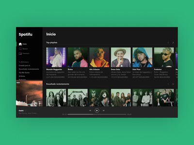

# Spotifu
**Spotifu** es una interfaz web inspirado en Spotify para Desktop. [Puedes verlo aquí.](https://fabiola29298.github.io/prototype-spotify/)

## Consideraciones técnicas sobre el proyecto
- Se utilizó Icon Fonts mediante [IcoMoon App](https://icomoon.io/).
- La metodología de nomenclatura para las clases en los nodos HTML es una mezcla de BEM y SUIT CSS. Ejemplo: `.myComponent`, `.myComponent-anotherPart`, .`is-state`.
- Se implementó pautas de [accesibilidad](https://developer.mozilla.org/es/docs/Web/Accessibility/ARIA) al contenido web

  <h3>
    <a href="https://fabiola29298.github.io/prototype-spotify/">
      Demo 📱
    </a>
     | 
    <a href="https://github.com/fabiola29298/prototype-spotify">
      Repositorio
    </a>
     | 
    <a href="https://leonidasesteban.com/proyectos">
      Diseño del proyecto
    </a>
  </h3>

## 🔍 Vista

## 📌 Stack

Para el proyecto se utilizó las siguientes tecnologías:

* HTML 5
* CSS 3

No se requiere paquetes o instaladores para ejecutar el proyecto.

## 🌟 Autor
* **Fabiola Acarapi**  - [@fabiola29298](https://github.com/fabiola29298)

## Créditos
Diseños de proyectos en
[LeonidasEsteban.com](https://leonidasesteban.com/proyectos/todos)